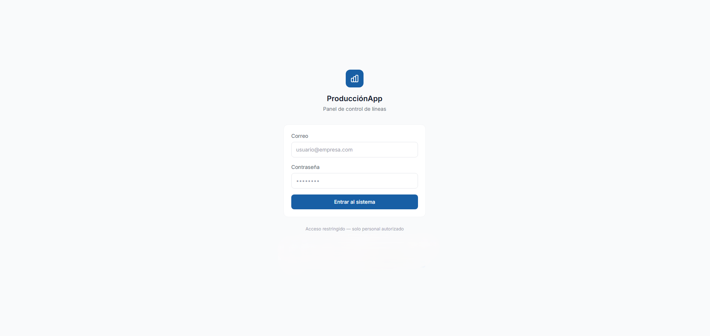
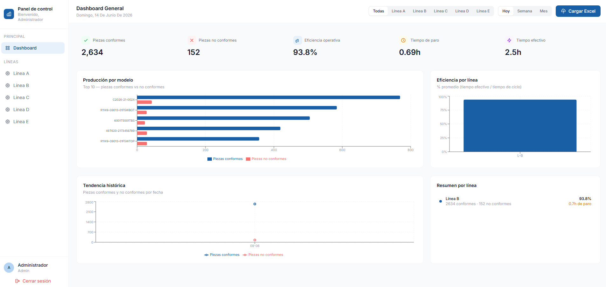
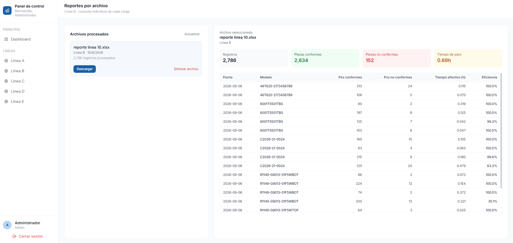

# Project_Tachyon

Aplicación web para monitoreo y gestión de líneas de producción.

Incluye autenticación de usuarios, dashboard con métricas visuales y módulo de carga de archivos Excel preparado para futuras funcionalidades de análisis y procesamiento de datos.

---

## 🚀 Tecnologías utilizadas

### Backend
- FastAPI
- SQLite
- Pandas
- Python 3.10+

### Frontend
- React
- Vite
- Tailwind CSS
- Axios
- Node.js 18+

---

## 📋 Requisitos

Antes de ejecutar el proyecto asegúrate de tener instalado:

- Python 3.10 o superior
- Node.js 18 o superior
- npm

---

### 2. Configurar el Backend

```bash
cd backend
pip install -r requirements.txt
python main.py
```

El backend estará disponible en:

```text
http://localhost:8000
```

Documentación automática de la API:

```text
http://localhost:8000/docs
```

---

### 3. Configurar el Frontend

Abrir una nueva terminal:

```bash
cd frontend
npm install
npm run dev
```

La aplicación estará disponible en:

```text
http://localhost:5173
```

---

## ✨ Funcionalidades actuales

- Inicio de sesión de usuarios.
- Dashboard con indicadores visuales.
- Métricas por día, semana y mes.
- Carga de archivos Excel.
- API REST desarrollada con FastAPI.
- Interfaz desarrollada con React y Tailwind CSS.

---

## 📁 Estructura del proyecto

```text
produccion-app/
│
├── backend/
│   ├── main.py
│   ├── excel_parser.py
│   ├── requirements.txt
│   └── produccion.db (se genera automáticamente)
│
├── frontend/
│   ├── src/
│   │   ├── pages/
│   │   ├── components/
│   │   ├── context/
│   │   ├── services/
│   │   └── index.css
│   │
│   ├── package.json
│   ├── vite.config.js
│   ├── tailwind.config.js
│   └── postcss.config.js
│
└── README.md
```

---

## Próximas funcionalidades

- [x] Procesamiento automático de archivos Excel.
- [ ] Generación de reportes PDF.
- [ ] Gestión avanzada de usuarios.
- [ ] Filtros por rango de fechas.
- [ ] Indicadores por línea de producción.
- [ ] Exportación de métricas.

---

## 📝 Notas

- La base de datos SQLite se crea automáticamente durante la primera ejecución del backend.
- Los archivos Excel cargados actualmente se almacenan para futuras funcionalidades de procesamiento.
- Este proyecto se encuentra en desarrollo y puede recibir cambios en la estructura y funcionalidades.

---

## 👨‍💻 Autor

Desarrollado como proyecto de gestión y monitoreo de producción


## 🗺️ Imagenes

## Login



## Dashboard Principal



## Módulo de Carga de Excel


